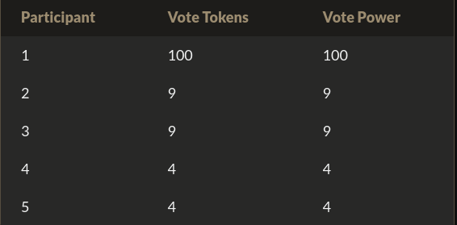
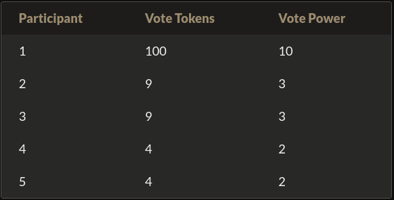
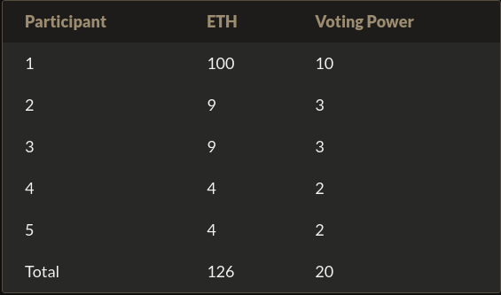
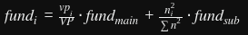
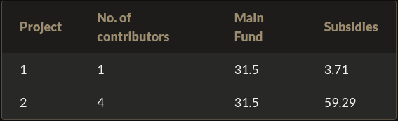

## Part1: Quadratic Voting
On entend souvent parler de DAO dans l'écosystème Web3. Signifiant un projet qui serait gouverné de façon décentralisée par les détenteurs de ses jetons. Vient alors un problème concernant les "Walles". Si l'une d'elles possède plus de 50% de la supply alors plus du tout de vote, c'est une oligarchie. Or ce n'est pas ce qu'on souhaite. Un système de a alors été mis au point pour tenter de résoudre ce problème.
- Un vote traditionnel donnerait autant de pouvoir de vote à un votant que de tokens en sa possession. Ainsi, on aurait un tableau comme suit :	

- On pourrait aussi imaginer un système de vote où chaque votant aurait une voix. Mais alors il n'y aurait pas beaucoup d'incitation à posséder plusieurs jetons et on aurait du mal à soutenir son prix.
    
- Vient alors l'idée du vote quadratique. Méthode qui se veut plus démocratique. On a une relation donnant n token = sqrt(n). Ainsi, les plus gros porteurs continuent d'avoir un plus grand pouvoir que les petits, mais leur influence est écrasée grâce à la relation quadratique donnant ainsi plus de pouvoir à la masse de petits porteurs. On obtient alors ceci :
	 
### Solution
```Solidity
  
contract VillageVoting is IVillageVoting {

/**

* @inheritdoc IVillageVoting

*/

mapping (address => uint256) public balanceOf;

mapping(uint256 => uint256[]) public proposalIds;

address[] villagers;

mapping (uint256 => mapping(uint256 => uint256)) public score;

mapping (address => bool) public voters;

uint256 public endTime;

uint256 public roundDuration;

uint256 winner;

uint256 round;

address owner;

constructor(

address[] memory _villagers,

uint256[] memory _voteTokens,

uint256[] memory _proposalIds,

uint256 _roundDuration

) payable {

owner = msg.sender;

round = 0;

villagers = _villagers;

roundDuration = _roundDuration;

endTime = block.timestamp + _roundDuration;

proposalIds[0] = _proposalIds;

for (uint i = 0; i < _villagers.length; i++){

balanceOf[_villagers[i]] = _voteTokens[i];

voters[_villagers[i]] = false;

}

}

  

/**

* @inheritdoc IVillageVoting

*/

function vote(

uint256[] calldata _proposalIds,

uint256[] calldata _amounts

) external {

require(block.timestamp < endTime);

require(!voters[msg.sender]);

voters[msg.sender] = true;

uint256 balance = balanceOf[msg.sender];

for (uint256 i = 0; i < _proposalIds.length; i++){

require(balance >= _amounts[i]);

score[round][_proposalIds[i]] += _amounts[i];

balance -= _amounts[i];

}

}

  

/**

* @inheritdoc IVillageVoting

*/

function countVotes() external {

require (msg.sender == owner);

require(block.timestamp > endTime);

uint256 equal = 0;

uint256 winnerScore = 0;

for (uint256 i = 0; i < proposalIds[round].length; i++){

if (score[round][proposalIds[round][i]] >= winnerScore){

if (score[round][proposalIds[round][i]] == winnerScore){

equal++;

} else {

winner = proposalIds[round][i];

winnerScore = score[round][proposalIds[round][i]];

equal = 0;

}

}

}

if (equal != 0){

round++;

endTime = block.timestamp + roundDuration;

uint256 y = 0;

uint256[] memory newProposal = new uint256[](proposalIds[round].length);

for (uint i = 0; i < villagers.length; i++){

voters[villagers[i]] = false;

}

for (uint i = 0; i < proposalIds[round - 1].length ; i++){

if (score[round - 1][proposalIds[round - 1][i]] == winnerScore){

newProposal[y] = proposalIds[round - 1][i];

y++;

}

}

proposalIds[round] = newProposal;

winner = 0;

winnerScore = 0;

}

}

  

/**

* @inheritdoc IVillageVoting

*/

function getActiveProposals() external view returns (uint256[] memory) {

if (block.timestamp < endTime){

return (proposalIds[round]);

}

uint256[] memory emptyArray;

return emptyArray;

}

  

/**

* @inheritdoc IVillageVoting

*/

function getRoundInfo() external view returns (uint256, uint256, uint256) {

return (winner, round, endTime);

}

  

/**

* @inheritdoc IVillageVoting

*/

function getProposalVotePower(uint256 _proposalId, uint256 _round)

external

view

returns (uint256)

{

return score[_round][_proposalId];

}

}
```
## Part2: Quadratic funding
- Une logique similaire peut s'appliquer dans le cadre du crowdfunding. Cette fois-ci, on distribue un pouvoir de vote en fonction du montant délégué dans un contrat de crowdfunding.
	 
- Ensuite, on va diviser le montant en deux fonds. Un principal et un autre subsidiaire. À chaque opération de crowdfunding de déterminer la proportion de chaque fond. Ici, nous prenons du 1 pour 1. Vient ensuite l'équation quadratique pour répartir les fonds de l'opération sur différents projets.

- vp-i = Somme du pouvoir de vote alloué au projet i
- vp = Total du pouvoir de vote sur l'opération de crowdfunding
- ni = nombre unique de contributeurs sur le projet i.
- Somme n au carré = La somme du carré du nombre de contributeurs uniques de chaque projet proposé dans cette offre de crowdfunding. 
On obtient alors cette répartition
	 

- Ainsi, on peut constater que l'on a mieux équilibré le financement en fonction de la masse et non des whales.

Bien évidemment, ces deux méthodes ont aussi leurs faiblesses et sont des explorations auxquelles il faut rajouter des sécurités pour s'assurer de l'utilisation juste de ces méthodes. Par exemple, réfléchir à limiter les dispersions de jetons sur différents wallets afin d'avoir plus de pouvoir de vote que prévus par le protocole (attaque Sybil). Il faudrait sans doute ajouter un mécanisme de proof of identity.

## Resume
Tout de suite on se rend compte que ça fait un smart contract plutôt conséquent avec beaucoup de variables à stocker. Les points vus dans cette quête :

- Utilisation de fonctions payable.
- Manipulation importante de map et tableau.
- Initialisation de variables via le constructeur.